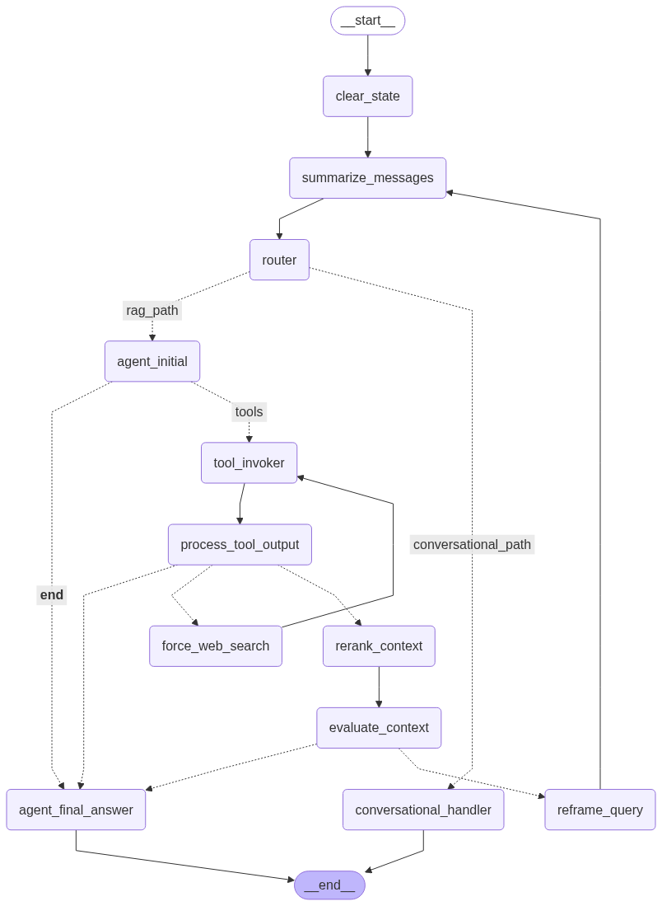

# GEMINI.md

## 1. Project Overview

This project implements a Telegram bot powered by a sophisticated, stateful agent built with Langchain and LangGraph. The agent is designed to answer questions based on a collection of spiritual documents, but it can also handle general conversation, remembering the context of your chat across multiple, distinct conversation threads.

The core of the project is a stateful agent that can intelligently route user queries. It can distinguish between general conversation and questions that require knowledge retrieval. For RAG queries, it uses a hybrid search approach (semantic and lexical) on a local knowledge base stored in ChromaDB. If the local search is insufficient, it can fall back to a web search using Tavily. The agent also features a self-correction loop with context evaluation and query reframing.

A key feature is its robust conversational memory and thread management. The agent maintains and summarizes conversation history within distinct, persistent threads stored in a backend like Firestore. Users can create new threads (`/new`), list their recent conversations (`/threads`), and switch between them (`/switch`), allowing for multiple, parallel, stateful conversations.
To ensure data persistence and scalability, the agent automatically indexes content retrieved from the web and periodically syncs the local vector database to a Google Cloud Storage bucket.

The project is designed for containerized deployment on Google Cloud Run, and it includes a `Dockerfile` and `cloudbuild.yaml` for automated builds and deployments.

## 2. System Architecture

### 2.1. Technology Stack
*   **Python:** Core programming language.
*   **Langchain & LangGraph:** Framework for building the RAG agent and defining the workflow.
*   **Google Generative AI (Gemini):** LLM used for understanding queries, evaluating context, reframing questions, and generating answers.
*   **ChromaDB:** Vector database for storing and retrieving document embeddings.
*   **Sentence Transformers:** (via `langchain-huggingface` and `sentence-transformers`) For generating document embeddings and for reranking (CrossEncoder).
*   **pyTelegramBotAPI:** Library for interacting with the Telegram Bot API.
*   **Flask:** Web framework for handling Telegram webhooks.
*   **Gunicorn:** WSGI HTTP server for running the Flask application.
*   **Google Cloud Storage:** For persistent storage of the vector database.
*   **Docker:** For containerizing the application, ensuring consistent environments.
*   **Google Cloud Run:** For scalable, serverless deployment of the containerized application.
*   **Tavily MCP:** Used for web search capabilities when local retrieval is insufficient.

### 2.2. High-Level Architecture

The application is designed around a central RAG agent that communicates with the user through a Telegram bot. The agent is built using LangGraph and is responsible for processing user queries, retrieving information, and generating responses. The application is deployed as a Docker container on Google Cloud Run.

### 2.3. Agent Workflow

The agent's intelligence comes from its explicit, graph-based workflow. It maintains an internal **AgentState** that tracks the full conversation history, allowing it to make smart, context-aware decisions.

Here's the step-by-step flow:

1.  **Query Routing:** When a new message arrives, it first goes to a **Router**. This router uses an LLM to classify the user's intent:
    *   **Conversational Query:** If the user asks something like "summarize our chat" or "what was my first question?", the router directs the flow to a dedicated `conversational_handler`. This node uses the full chat history to generate an answer and the process ends.
    *   **RAG Query:** If the user asks a knowledge-based question (e.g., "What did Baba say about...?"), the router sends it down the full RAG pipeline.

2.  **The RAG Pipeline:**
    *   **Tool Calling:** A specialized node uses a focused, "isolated" prompt to reliably decide which tool to call (e.g., `retrieve_context`).
    *   **Local Retrieval (Hybrid Search):** The agent first attempts to find information by performing a hybrid search (semantic + lexical) on the local knowledge base.
    *   **Forced Web Fallback:** If the initial local retrieval fails to find any documents (e.g., the requested Murli date is not in the local DB), the agent doesn't give up. It automatically triggers a `force_web_search` node. This node dynamically constructs a URL based on the date and language from the user's query and forces a call to the `tavily-extract` tool to fetch the content directly from an external website.
    *   **Sentence Window Retrieval:** To ensure the LLM receives complete context, the agent doesn't just use the single most relevant chunk. Instead, for each retrieved chunk, it reconstructs a "window" of context by also fetching the chunks immediately before and after it from the original document. This prevents issues where the best matching chunk is only part of a sentence or paragraph, giving the LLM a more coherent and comprehensive view of the information before it's passed on for reranking and final answer generation.
    *   **Web Content Indexing & DB Sync**: After a tool call (especially a web search), the `process_tool_output` node prepares any newly retrieved documents (e.g., from a `tavily-extract` call), which are tracked in the `docs_to_index` field of the agent's state. The subsequent `index_and_sync` node then takes these documents, adds them to the local ChromaDB vector store, and triggers an asynchronous sync of the entire vector store to a Google Cloud Storage bucket. This ensures that knowledge gained from web searches is persisted.
    *   **Context Reranking:** The retrieved documents (from local or web search) are reranked using a CrossEncoder model to bring the most relevant passages to the top.
    *   **Relevance Evaluation:** The agent evaluates if the reranked context is sufficient to answer the original question.
    *   **Self-Correction (Query Reframing):** If the *evaluated* context is still insufficient, the agent rephrases the query and re-runs the retrieval process. This acts as a built-in retry mechanism to improve understanding.
    *   **Grounded Generation:** Finally, a dedicated node takes the validated context (from local or web) and the full conversation history to generate a high-quality, grounded answer in a structured JSON format.

This explicit, router-based architecture allows the agent to be both a powerful, accurate RAG system and a coherent, stateful conversationalist without compromising on either capability.

### 2.4. Workflow Diagram

The following diagram visualizes the agent's workflow:



## 3. Data Models

### 3.1. AgentState

The `AgentState` is a `TypedDict` that represents the state of the LangGraph agent. It holds all the information that is passed between the nodes in the graph. Here is a breakdown of its fields:

*   `messages`: A list of `BaseMessage` objects that represent the conversation history.
*   `original_query`: The original query from the user.
*   `current_query`: The current query being processed by the agent. This can be the same as the original query or a reframed version of it.
*   `retrieved_context`: The context that has been retrieved from the vector store or the web.
*   `retry_attempted`: A boolean flag that indicates whether the agent has attempted to reframe the query.
*   `evaluation_result`: The result of the context evaluation, which can be 'sufficient' or 'insufficient'.
*   `raw_retrieved_docs`: A list of the raw documents retrieved from the vector store before reranking.
*   `language_code`: The language code for the conversation (e.g., 'en' or 'hi').
*   `documents`: A list of `Document` objects that have been retrieved and processed.
*   `web_search_attempted`: A boolean flag that indicates whether the agent has attempted a web search.
*   `last_retrieval_source`: The source of the last retrieval, which can be 'local' or 'web'.
*   `mode`: The current mode of the agent, which can be 'default' or 'research'.
*   `context`: A dictionary that holds the context for the summarization node.
*   `route_decision`: The decision made by the router, which can be 'RAG_QUERY' or 'CONVERSATIONAL_QUERY'.
*   `summary_was_triggered`: A boolean flag that indicates whether the conversation history was just summarized.
*   `docs_to_index`: A list of `Document` objects retrieved from the web that are queued for indexing into the vector store.

## 4. File Overview

### Core (`RAG_BOT/src/`)

*   **`main.py`**: The main entry point for the application. It orchestrates the setup of the configuration, vector store, document indexer, and the Telegram bot.
*   **`rag_agent.py`**: Contains an example script for running the RAG agent directly, useful for testing and debugging.
*   **`logger.py`**: Configures the centralized logger for the application.
*   **`file_manager.py`**: Handles file system operations, such as moving indexed files.
*   **`utils.py`**: A utility module containing helper functions for tasks like extracting dates, parsing JSON, and detecting document language.

### Agent (`RAG_BOT/src/agent/`)

*   **`graph_builder.py`**: Defines the structure and logic of the LangGraph agent. It wires together all nodes (routing, retrieval, evaluation, generation) and conditional edges. It also integrates a summarization node for managing long conversation histories and is configured with a `checkpointer` (e.g., for Firestore) to persist agent state across runs.
*   **`state.py`**: Defines the `AgentState` TypedDict, which represents the state of the LangGraph agent. This state is tied to a specific conversation thread and includes the full message history, retrieved context, and other transient information for a single run.
*   **`agent_node.py`**: This file contains the core logic for the RAG (Retrieval-Augmented Generation) path of the agent. It has two main functions: `handle_question_node` and `generate_final_response`. `handle_question_node` is the entry point for the RAG workflow. It takes the user's query, constructs a prompt with recent conversational history, and invokes the LLM with a set of tools to decide the initial action (e.g., call the `retrieve_context` tool). It also manages the agent's state, initializing it for the RAG process. `generate_final_response` is the final node in the RAG path. It takes the retrieved and evaluated context and generates a formatted JSON response. If the retrieval process fails or the context is deemed insufficient, this node can fall back to using the LLM's internal knowledge to answer the user's query.
*   **`router_node.py`**: Implements the logic to classify a user's query as either a "RAG_QUERY" or a "CONVERSATIONAL_QUERY" to direct the workflow.
*   **`conversational_node.py`**: This file implements the logic for handling conversational queries that do not require knowledge retrieval. The `conversational_node` function is the single entry point for this path. It takes the complete, cleaned conversation history from the agent's state and uses it to generate a response to meta-questions (e.g., "summarize our chat") or general chit-chat. A key feature of this node is its ability to handle multi-lingual conversations by dynamically appending a language instruction to the prompt, ensuring the LLM's response is in the user's preferred language, even if the conversation history contains multiple languages.
*   **`retrieval_nodes.py`**: Contains the `rerank_context_node`, which reranks the retrieved documents for relevance.
*   **`evaluation_nodes.py`**: Includes nodes for evaluating the retrieved context (`evaluate_context_node`) and reframing the query if the context is insufficient (`reframe_query_node`).
*   **`process_tool_output_node.py`**: Parses the output from tool calls (like `retrieve_context` or Tavily web search) and updates the agent's state.
*   **`prompts.py`**: Contains helper functions that construct and return `ChatPromptTemplate` objects for the various agent nodes.
*   **`indexing_node.py`**: Contains the logic for the `index_and_sync` node, which adds new documents to the local vector store and triggers the GCS sync.
*   **`custom_nodes.py`**: Contains custom nodes for the LangGraph agent, such as the `LoggingSummarizationNode`.

### Configuration (`RAG_BOT/src/config/`)

*   **`config.py`**: Defines the `Config` class, which loads and manages all configuration settings from environment variables and the `prompts.yaml` file.
*   **`prompts.yaml`**: A YAML file containing all the system and user-facing prompts used by the agent.

### Context Retrieval (`RAG_BOT/src/context_retrieval/`)

*   **`context_retriever_tool.py`**: Defines the `retrieve_context` tool, which performs a hybrid search (semantic + lexical) to fetch relevant documents.
*   **`bm25_processor.py`**: Handles the BM25 lexical search part of the hybrid retrieval.
*   **`filter_processor.py`**: Prepares the filters (e.g., for date and language) to be used in the retrieval query.
*   **`result_processor.py`**: Combines and deduplicates the results from the semantic and BM25 searches.

### Persistence (`RAG_BOT/src/persistence/`)

*   **`vector_store.py`**: Manages the local ChromaDB vector store, including initialization, adding documents, and querying the index.
*   **`firestore_thread_manager.py`**: Implements the `AbstractThreadManager` interface using Google Firestore. It handles creating, listing, switching, and deleting conversation threads, ensuring persistent and scalable conversation management.
*   **`user_settings_manager.py`**: Manages user-specific settings (like preferred language) in a persistent backend like SQLite.
*   **`update_manager.py`**: A utility to prevent processing duplicate Telegram updates by storing and checking update IDs in a SQLite database.

### Processing (`RAG_BOT/src/processing/`)

*   **`document_processor.py`**: A base class for document processing, containing common logic for splitting text and extracting metadata.
*   **`pdf_processor.py`**: A subclass of `DocumentProcessor` that specifically handles loading and processing PDF files.
*   **`htm_processor.py`**: A subclass of `DocumentProcessor` for loading and processing HTM files.

### Services (`RAG_BOT/src/services/`)

*   **`document_indexer.py`**: Orchestrates the document indexing process, using the file manager and document processors to get documents into the vector store.
*   **`message_handler.py`**: Contains the core logic for processing incoming messages. It manages user sessions, determines the correct conversation `thread_id` for stateful interactions, invokes the agent, and formats the final response.
*   **`gcs_uploader.py`**: Implements the `GCSUploaderService`, which handles the asynchronous synchronization of the local vector store directory to a specified Google Cloud Storage bucket.

### Telegram (`RAG_BOT/src/telegram/`)

*   **`bot.py`**: This is the main entry point for the Telegram bot. It initializes the Flask application, the Telegram bot itself, and all the necessary handlers. It's responsible for setting up the webhook, handling incoming updates from Telegram, and dispatching them to the appropriate handlers. It also manages the asyncio event loop that is used to run the agent's asynchronous tasks.

#### Handlers (`RAG_BOT/src/telegram/handlers/`)

*   **`handler_registry.py`**: This class is responsible for instantiating and registering all the command and message handlers for the bot. It acts as a central point for managing the bot's interactive logic.
*   **`base_handler.py`**: An abstract base class that all other handlers inherit from. It provides common functionality, such as sending responses to the user and accessing shared resources like the bot instance, configuration, and database managers.
*   **`general_commands.py`**: Implements the handlers for the `/start` and `/help` commands.
*   **`language_command.py`**: Implements the handler for the `/language` command, which allows users to set their preferred language.
*   **`mode_command.py`**: Implements the handler for the `/mode` command, which allows users to set the bot's response mode (e.g., 'default' or 'research').
*   **`thread_commands.py`**: Implements the handlers for the full lifecycle of thread management: `/new`, `/threads`, `/switch`, and `/delete`.
*   **`document_handler.py`**: Implements the handler for processing incoming documents (PDFs and HTM files) that users upload for indexing.
*   **`text_message_handler.py`**: This is the catch-all handler for any text message that is not a command. It schedules the asynchronous processing of the message to avoid blocking the webhook response.

#### Utilities (`RAG_BOT/src/telegram/`)
*   **`thread_cli.py`**: A command-line utility for backend administrators to manage user threads directly (e.g., listing or deleting threads for a specific user).

### Evaluation (`RAG_BOT/src/evaluation/`)

*   **`eval_rag_bot.py`**: The main script for running evaluations on the RAG agent using LangSmith.
*   **`hallucination_eval.py`**: Defines a custom evaluator to measure the degree of hallucination in the agent's responses.
*   **`retrieval_relevance_eval.py`**: Defines a custom evaluator to assess the relevance of the retrieved context to the user's query.

## 5. Setup and Deployment

### 5.1. Local Development

1.  **Clone the repository:**
    ```bash
    git clone <your-repository-url>
    cd RAG_BOT
    ```

2.  **Create a virtual environment:**
    ```bash
    python -m venv venv
    source venv/bin/activate  # On Windows use `venv\Scripts\activate`
    ```

3.  **Install dependencies:**
    ```bash
    pip install -r requirements.txt
    ```

4.  **Configure Environment Variables:**
    Create a `.env` file in the project root directory and add the following variables:
    ```dotenv
    # Telegram
    TELEGRAM_BOT_TOKEN="YOUR_TELEGRAM_BOT_TOKEN"
    WEBHOOK_URL="YOUR_PUBLIC_HTTPS_URL_FOR_WEBHOOK" # e.g., from ngrok or your deployment

    # Google Gemini
    GEMINI_API_KEY="YOUR_GOOGLE_API_KEY"

    # Google Cloud Project ID (required for Firestore)
    GCP_PROJECT_ID="your-gcp-project-id"

    # Tavily (for web search fallback)
    TAVILY_API_KEY="YOUR_TAVILY_API_KEY"

    # Paths (adjust if needed)
    VECTOR_STORE_PATH="./chroma_db"       # Default path for ChromaDB
    DATA_PATH="./data"                    # Directory for documents to be indexed on startup
    # INDEXED_DATA_PATH="./indexed_data"  # (Optional) Path to move indexed files, if implemented

    # Agent/Model Config (adjust defaults in config.py or override here)
    # LLM_MODEL_NAME="gemini-1.5-flash-latest" # Or another compatible Gemini model
    # JUDGE_LLM_MODEL_NAME="gemini-1.5-flash-latest" # LLM for evaluating context/responses
    # EMBEDDING_MODEL_NAME="all-MiniLM-L6-v2"
    # RERANKER_MODEL_NAME="cross-encoder/ms-marco-MiniLM-L-6-v2" # Or other CrossEncoder model
    # TEMPERATURE=0.1
    # INITIAL_RETRIEVAL_K=20 # Number of documents to initially retrieve before reranking (semantic)
    # BM25_TOP_K=10          # Number of documents to retrieve using BM25 (lexical)
    # BM25_MAX_CORPUS_SIZE=10000 # Max corpus size for BM25 indexing
    # RERANK_TOP_N=5         # Number of documents to keep after reranking
    # SEARCH_TYPE="similarity" # Or "mmr" (for ChromaDB semantic search)
    # SEMANTIC_CHUNKING=True # Or False
    # LANGUAGE="en" # Default language for the bot (e.g., 'en', 'hi')
    # LOG_LEVEL="INFO"
    # MAX_CONVERSATION_HISTORY=10
    # MAX_RECON_MURLIS=5 # Max Murlis to reconstruct from chunks
    # MAX_CHUNKS_PER_MURLI_RECON=20 # Max chunks to fetch for a single Murli reconstruction
    # MAX_CHUNKS_FOR_DATE_FILTER=40 # Max chunks to consider for date filtering
    # ASYNC_OPERATION_TIMEOUT=60 # Timeout for async operations in seconds
    # PORT=5000 # Port for Flask app
    ```
    *   Replace placeholders with your actual credentials and desired settings.
    *   For local development, ensure the `WEBHOOK_URL` is a publicly accessible HTTPS URL pointing to where your Flask app will run. Tools like `ngrok` can be useful for this. For production on Cloud Run, this will be the URL of your service.

5.  **Running the bot:**
    For development, you can run the bot using Flask's built-in server:
    ```bash
    python RAG_BOT/src/telegram/bot.py
    ```
    For a more production-like environment, you can use Gunicorn:
    ```bash
    gunicorn -b 0.0.0.0:5000 RAG_BOT.src.telegram.bot:app
    ```

### 5.2. Docker

The project includes a `Dockerfile` for containerized builds.

1.  **Build the Docker image:**
    ```bash
    docker build -t rag-bot .
    ```

2.  **Run the Docker container:**
    ```bash
    docker run -p 5000:5000 --env-file .env rag-bot
    ```

### 5.3. Google Cloud Run Deployment

This project is designed for production deployment on Google Cloud Run using a container-based workflow. The provided `Dockerfile` and `cloudbuild.yaml` automate this process.

#### Prerequisites

Before deploying, ensure you have the following set up in your Google Cloud project:

1.  **Google Cloud Project:** A project with billing enabled.
2.  **gcloud CLI:** The Google Cloud CLI installed and authenticated (`gcloud auth login`, `gcloud config set project YOUR_PROJECT_ID`).
3.  **Enabled APIs:** Enable the following APIs in your project:
    *   Cloud Build API
    *   Cloud Run Admin API
    *   Artifact Registry API
    *   Secret Manager API
4.  **Artifact Registry:** Create a Docker repository in Artifact Registry to store your container images. The `cloudbuild.yaml` assumes a repository named `cloud-run-source-deploy` in the `us-central1` region.
5.  **Secret Manager:** Store all sensitive credentials (API keys, tokens) as secrets in Google Secret Manager. The `cloudbuild.yaml` is configured to securely mount these secrets into the Cloud Run service. The required secrets are:
    *   `GOOGLE_API_KEY`
    *   `GEMINI_API_KEY`
    *   `TAVILY_API_KEY`
    *   `TELEGRAM_BOT_TOKEN`
    *   `LANGCHAIN_API_KEY`
6.  **Google Cloud Storage (GCS):** Create a GCS bucket to store the ChromaDB vector store persistently. The `startup.sh` script in the Docker image will download the database from this bucket on startup. Update the `GCS_VECTOR_STORE_PATH` environment variable in `cloudbuild.yaml` to point to your bucket (e.g., `gs://your-rag-bot-bucket`).

#### Deployment Process

The deployment is automated using Cloud Build.

1.  **Dockerfile:** The `Dockerfile` is a multi-stage build file that:
    *   **Builder Stage:** Installs Python dependencies and pre-downloads and caches the large embedding and reranker models from Hugging Face. This makes the final image smaller and startup times faster.
    *   **Runtime Stage:** Creates a lean final image, copies the installed dependencies and cached models from the builder stage, installs `gsutil` for GCS access, and sets up the application code.

2.  **cloudbuild.yaml:** This file defines a three-step CI/CD pipeline:
    *   **Build:** Builds the Docker image using the `Dockerfile`.
    *   **Push:** Pushes the built image to your Artifact Registry repository.
    *   **Deploy:** Deploys the new image to your Cloud Run service (`rag-bot`). This step also configures all necessary service settings, including memory, CPU, environment variables, and mounts the secrets from Secret Manager.

3.  **Triggering the Deployment:**
    To deploy the agent, run the following command from the root of the project directory (`LLM_agents`):
    ```bash
    gcloud builds submit --config cloudbuild.yaml .
    ```
    Cloud Build will execute the steps defined in `cloudbuild.yaml`, and your Cloud Run service will be updated with the new version of the bot. The first deployment will create the service. After deployment, remember to set the Telegram webhook to your new Cloud Run service URL.

## 6. Usage

1.  **Start the Bot:**
    Ensure your `.env` file is configured. If using Docker (recommended for Gunicorn):
    ```bash
    docker build -t rag-bot .
    docker run -p 5000:5000 --env-file .env rag-bot
    ```
    Alternatively, to run directly with Gunicorn (if installed locally):
    ```bash
    gunicorn -b 0.0.0.0:5000 bot:app
    ```
    Or for development with Flask's built-in server:
    ```bash
    python bot.py
    ```
    This will start the application server and set up the Telegram webhook. The bot will also attempt to index any documents found in the `DATA_PATH` directory.

2.  **Interact with the Bot on Telegram:**
    *   Find your bot on Telegram.
    *   Send `/start` to initiate interaction.
    *   Send `/help` to see available commands.
    *   **Set Language:** Use `/language hindi` or `/language english` to set your preferred language for bot responses.
    *   **Upload Documents:** Send PDF or HTM documents directly to the chat to have them indexed. The bot will attempt to detect the document's language and index it.
    *   **Manage Conversations:** Use `/new`, `/threads`, `/switch <number>`, and `/delete <number>` to manage your conversation threads.
    *   **Query Documents:**
        *   Send a general message: `What were the main points about soul consciousness on 1969-01-23?` (The agent will attempt retrieval).
    *   **Conversational Questions:** Ask questions about the chat itself (e.g., "summarize our conversation"). The agent will use its memory to answer.

## 7. Testing

Navigate to the project root directory and run the integration tests using `unittest`:

```bash
python -m unittest discover -s RAG_BOT/tests/integration -p 'test_*.py'
```

## 8. Development Conventions

*   **Configuration:** A dedicated `Config` class in `RAG_BOT/src/config/config.py` manages all settings. It loads configuration from environment variables (`.env` file) and a `prompts.yaml` file, allowing for overrides. This provides a clean separation of configuration from code.
*   **Code Structure:** The main application logic resides in the `RAG_BOT/src` directory. The code is organized into modules with clear responsibilities (e.g., `agent`, `persistence`, `processing`, `telegram`), following the principle of separation of concerns.
*   **Styling:** The code adheres to the PEP 8 style guide, using `snake_case` for variables and function names.
*   **Type Hinting:** The project uses Python's type hints for function signatures to improve code clarity and enable static analysis.
*   **Asynchronous Operations:** The project makes extensive use of `asyncio` for handling concurrent operations, which is crucial for a responsive Telegram bot that interacts with multiple services.
*   **Logging:** A centralized logger is configured in `RAG_BOT/src/logger.py` and used throughout the application for debugging and monitoring.
*   **Dependencies:** All Python dependencies are listed in `requirements.txt`.
*   **Packaging:** The project is packaged as a Python package using `setup.py`.
*   **Deployment:** The project is designed for deployment on Google Cloud Run. The `Dockerfile` and `cloudbuild.yaml` files define the build and deployment process.
*   **Vector Store:** The application uses ChromaDB as its vector store. The `startup.sh` script handles downloading the vector store from GCS on startup.
