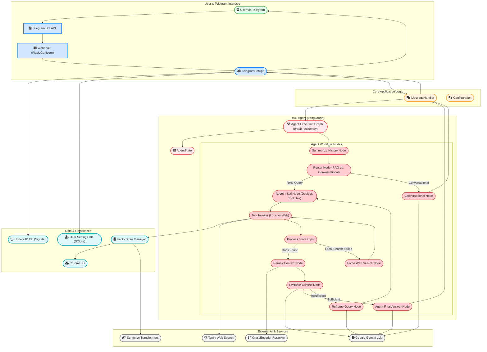

# GEMINI.md

## Project Overview
This project implements a Telegram bot powered by a sophisticated, stateful agent built with Langchain and LangGraph. The agent is designed to answer questions based on a collection of spiritual documents, but it can also handle general conversation, remembering the context of your chat across multiple, distinct conversation threads.

The core of the project is a stateful agent that can intelligently route user queries. It can distinguish between general conversation and questions that require knowledge retrieval. For RAG queries, it uses a hybrid search approach (semantic and lexical) on a local knowledge base stored in ChromaDB. If the local search is insufficient, it can fall back to a web search using Tavily. The agent also features a self-correction loop with context evaluation and query reframing.

A key feature is its robust conversational memory and thread management. The agent maintains and summarizes conversation history within distinct, persistent threads stored in a backend like Firestore. Users can create new threads (`/new`), list their recent conversations (`/threads`), and switch between them (`/switch`), allowing for multiple, parallel, stateful conversations.

The project is designed for containerized deployment on Google Cloud Run, and it includes a `Dockerfile` and `cloudbuild.yaml` for automated builds and deployments.

## Architecture

The following diagram illustrates the high-level architecture of the RAG Bot, from user interaction to the final response generation.


## File Overview

### Core (`RAG_BOT/src/`)

*   **`main.py`**: The main entry point for the application. It orchestrates the setup of the configuration, vector store, document indexer, and the Telegram bot.
*   **`rag_agent.py`**: Contains an example script for running the RAG agent directly, useful for testing and debugging.
*   **`logger.py`**: Configures the centralized logger for the application.
*   **`file_manager.py`**: Handles file system operations, such as moving indexed files.
*   **`utils.py`**: A utility module containing helper functions for tasks like extracting dates, parsing JSON, and detecting document language.

### Agent (`RAG_BOT/src/agent/`)

*   **`graph_builder.py`**: Defines the structure and logic of the LangGraph agent. It wires together all nodes (routing, retrieval, evaluation, generation) and conditional edges. It also integrates a summarization node for managing long conversation histories and is configured with a `checkpointer` (e.g., for Firestore) to persist agent state across runs.
*   **`state.py`**: Defines the `AgentState` TypedDict, which represents the state of the LangGraph agent. This state is tied to a specific conversation thread and includes the full message history, retrieved context, and other transient information for a single run.
*   **`agent_node.py`**: Contains the primary logic for the agent, including handling the initial user query and generating the final response.
*   **`router_node.py`**: Implements the logic to classify a user's query as either a "RAG_QUERY" or a "CONVERSATIONAL_QUERY" to direct the workflow.
*   **`conversational_node.py`**: Handles queries that are classified as conversational, using the chat history to respond.
*   **`retrieval_nodes.py`**: Contains the `rerank_context_node`, which reranks the retrieved documents for relevance.
*   **`evaluation_nodes.py`**: Includes nodes for evaluating the retrieved context (`evaluate_context_node`) and reframing the query if the context is insufficient (`reframe_query_node`).
*   **`process_tool_output_node.py`**: Parses the output from tool calls (like `retrieve_context` or Tavily web search) and updates the agent's state.
*   **`prompts.py`**: Contains helper functions that construct and return `ChatPromptTemplate` objects for the various agent nodes.

### Configuration (`RAG_BOT/src/config/`)

*   **`config.py`**: Defines the `Config` class, which loads and manages all configuration settings from environment variables and the `prompts.yaml` file.
*   **`prompts.yaml`**: A YAML file containing all the system and user-facing prompts used by the agent.

### Context Retrieval (`RAG_BOT/src/context_retrieval/`)

*   **`context_retriever_tool.py`**: Defines the `retrieve_context` tool, which performs a hybrid search (semantic + lexical) to fetch relevant documents.
*   **`bm25_processor.py`**: Handles the BM25 lexical search part of the hybrid retrieval.
*   **`filter_processor.py`**: Prepares the filters (e.g., for date and language) to be used in the retrieval query.
*   **`result_processor.py`**: Combines and deduplicates the results from the semantic and BM25 searches.

### Persistence (`RAG_BOT/src/persistence/`)

*   **`vector_store.py`**: Manages the ChromaDB vector store, including initialization, adding documents, and querying the index.
*   **`user_settings_manager.py`**: Manages user-specific settings (like preferred language) in a persistent backend like SQLite.
*   **`update_manager.py`**: A utility to prevent processing duplicate Telegram updates by storing and checking update IDs in a SQLite database.

### Processing (`RAG_BOT/src/processing/`)

*   **`document_processor.py`**: A base class for document processing, containing common logic for splitting text and extracting metadata.
*   **`pdf_processor.py`**: A subclass of `DocumentProcessor` that specifically handles loading and processing PDF files.
*   **`htm_processor.py`**: A subclass of `DocumentProcessor` for loading and processing HTM files.

### Services (`RAG_BOT/src/services/`)

*   **`document_indexer.py`**: Orchestrates the document indexing process, using the file manager and document processors to get documents into the vector store.
*   **`message_handler.py`**: Contains the core logic for processing incoming messages. It manages user sessions, determines the correct conversation `thread_id` for stateful interactions, invokes the agent, and formats the final response.

### Telegram (`RAG_BOT/src/telegram/`)

*   **`bot.py`**: Contains the core logic for the Telegram bot, including the Flask application for the webhook. It defines all message handlers for commands (like `/start`, `/language`, and thread management commands `/new`, `/threads`, `/switch`), text messages, and document uploads.

### Evaluation (`RAG_BOT/src/evaluation/`)

*   **`eval_rag_bot.py`**: The main script for running evaluations on the RAG agent using LangSmith.
*   **`hallucination_eval.py`**: Defines a custom evaluator to measure the degree of hallucination in the agent's responses.
*   **`retrieval_relevance_eval.py`**: Defines a custom evaluator to assess the relevance of the retrieved context to the user's query.

## Building and Running

### Local Development

1.  **Create a virtual environment:**
    ```bash
    python -m venv venv
    source venv/bin/activate
    ```

2.  **Install dependencies:**
    ```bash
    pip install -r requirements.txt
    ```

3.  **Configure Environment Variables:**
    Create a `.env` file in the project root and add the necessary environment variables as specified in the `README.md`.

4.  **Running the bot:**
    For development, you can run the bot using Flask's built-in server:
    ```bash
    python RAG_BOT/src/telegram/bot.py
    ```
    For a more production-like environment, you can use Gunicorn:
    ```bash
    gunicorn -b 0.0.0.0:5000 RAG_BOT.src.telegram.bot:app
    ```

### Docker

The project includes a `Dockerfile` for containerized builds.

1.  **Build the Docker image:**
    ```bash
    docker build -t rag-bot .
    ```

2.  **Run the Docker container:**
    ```bash
    docker run -p 5000:5000 --env-file .env rag-bot
    ```

### Google Cloud Run Deployment

The project is set up for automated deployment to Google Cloud Run using Cloud Build.

1.  **Prerequisites:**
    *   A Google Cloud project with billing enabled.
    *   `gcloud` CLI installed and configured.
    *   Cloud Build, Cloud Run, Artifact Registry, and Secret Manager APIs enabled.
    *   An Artifact Registry repository.
    *   Secrets stored in Secret Manager.
    *   A GCS bucket for the ChromaDB vector store.

2.  **Deploy:**
    To deploy the application, run the following command from the project root:
    ```bash
    gcloud builds submit --config cloudbuild.yaml .
    ```

## Development Conventions

*   **Configuration:** A dedicated `Config` class in `RAG_BOT/src/config/config.py` manages all settings. It loads configuration from environment variables (`.env` file) and a `prompts.yaml` file, allowing for overrides. This provides a clean separation of configuration from code.
*   **Code Structure:** The main application logic resides in the `RAG_BOT/src` directory. The code is organized into modules with clear responsibilities (e.g., `agent`, `persistence`, `processing`, `telegram`), following the principle of separation of concerns.
*   **Styling:** The code adheres to the PEP 8 style guide, using `snake_case` for variables and function names.
*   **Type Hinting:** The project uses Python's type hints for function signatures to improve code clarity and enable static analysis.
*   **Asynchronous Operations:** The project makes extensive use of `asyncio` for handling concurrent operations, which is crucial for a responsive Telegram bot that interacts with multiple services.
*   **Logging:** A centralized logger is configured in `RAG_BOT/src/logger.py` and used throughout the application for debugging and monitoring.
*   **Dependencies:** All Python dependencies are listed in `requirements.txt`.
*   **Packaging:** The project is packaged as a Python package using `setup.py`.
*   **Testing:** Integration tests are located in the `RAG_BOT/tests/integration` directory and can be run using `unittest`.
    ```bash
    python -m unittest discover -s RAG_BOT/tests/integration -p 'test_*.py'
    ```
*   **Deployment:** The project is designed for deployment on Google Cloud Run. The `Dockerfile` and `cloudbuild.yaml` files define the build and deployment process.
*   **Vector Store:** The application uses ChromaDB as its vector store. The `startup.sh` script handles downloading the vector store from GCS on startup.
