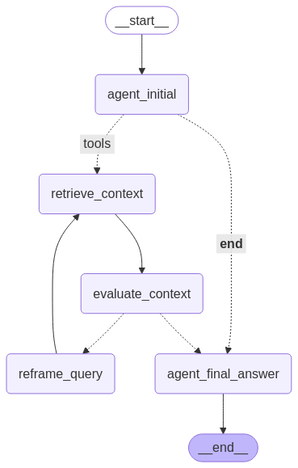

# RAG_BOT: Telegram RAG Agent for Spiritual Documents

This project implements a Telegram bot powered by a Retrieval-Augmented Generation (RAG) agent built with Langchain and LangGraph. The agent is designed to answer questions based on a collection of spiritual documents stored in a ChromaDB vector store.

## Features

*   **Telegram Interface:** Interact with the RAG agent directly through Telegram.
*   **RAG Pipeline:** Utilizes a sophisticated LangGraph agent for:
    *   Retrieving relevant context from spiritual documents based on user queries.
    *   Evaluating the relevance of retrieved context.
    *   Reframing the user's query if the initial context is insufficient.
    *   Generating answers grounded in the retrieved documents using Google's Gemini models.
*   **Vector Store:** Uses ChromaDB to store and query document embeddings.
*   **Document Indexing:** Upload PDF documents directly to the Telegram bot for automatic indexing into the vector store.
*   **Date Filtering:** Supports filtering queries by date using the format `date:YYYY-MM-DD` within the `/query` command or general messages.
*   **Session Management:** Basic in-memory session handling for conversation context (via `MessageHandler`).
*   **Webhook Deployment:** Designed for deployment using Flask and Telegram webhooks.
*   **Configuration:** Centralized configuration management (`config.py`).
*   **Logging:** Structured logging for monitoring and debugging (`logger.py`).
*   **Integration Tests:** Includes tests to verify core functionalities like indexing, retrieval, and agent logic.

## Technology Stack

*   **Python:** Core programming language.
*   **Langchain & LangGraph:** Framework for building the RAG agent and defining the workflow.
*   **Google Generative AI (Gemini):** LLM used for understanding queries, evaluating context, reframing questions, and generating answers.
*   **ChromaDB:** Vector database for storing and retrieving document embeddings.
*   **Sentence Transformers:** (via `langchain-huggingface`) For generating document embeddings.
*   **pyTelegramBotAPI:** Library for interacting with the Telegram Bot API.
*   **Flask:** Web framework for handling Telegram webhooks.

## How It Works

Think of the bot as an intelligent assistant that uses a specific process to answer your questions, especially those about the indexed spiritual documents. Here's the flow:

1.  **Query Analysis:** First, the agent analyzes your question. Does it need to consult the documents, or is it a general question it already knows?
2.  **Smart Retrieval:** If documents are needed, it searches the knowledge base (ChromaDB) for the most relevant snippets based on your query.
3.  **Relevance Check:** The agent doesn't just blindly use what it finds. It evaluates if the retrieved information *actually* helps answer your original question.
4.  **Self-Correction Loop:** If the initial context isn't good enough, the agent smartly rephrases the query and tries searching again – a built-in retry mechanism for better results.
5.  **Grounded Generation:** Finally, using the validated context, the agent generates a clear answer. If no relevant context is found even after the retry, it informs the user gracefully.

This graph-based approach allows the agent to dynamically decide its path, evaluate its own findings, and even self-correct, leading to more accurate and relevant answers.

### Workflow Diagram

The following diagram visualizes the agent's workflow:


## Setup

1.  **Clone the repository:**
    ```bash
    git clone <your-repository-url>
    cd RAG_BOT
    ```

2.  **Create a virtual environment:**
    ```bash
    python -m venv venv
    source venv/bin/activate  # On Windows use `venv\Scripts\activate`
    ```

3.  **Install dependencies:**
    ```bash
    pip install -r requirements.txt
    ```

4.  **Configure Environment Variables:**
    Create a `.env` file in the project root directory and add the following variables:
    ```dotenv
    # Telegram
    TELEGRAM_BOT_TOKEN="YOUR_TELEGRAM_BOT_TOKEN"
    WEBHOOK_URL="YOUR_PUBLIC_HTTPS_URL_FOR_WEBHOOK" # e.g., from ngrok or your deployment

    # Google Gemini
    GEMINI_API_KEY="YOUR_GOOGLE_API_KEY"

    # Paths (adjust if needed)
    VECTOR_STORE_PATH="./chroma_db" # Default path for ChromaDB

    # Agent/Model Config (adjust defaults in config.py or override here)
    # LLM_MODEL_NAME="gemini-1.5-flash-latest" # Or another compatible Gemini model
    # EMBEDDING_MODEL_NAME="all-MiniLM-L6-v2"
    # TEMPERATURE=0.1
    # K=10 # Number of documents to retrieve
    # SEARCH_TYPE="similarity" # Or "mmr"
    # SEMANTIC_CHUNKING=True # Or False
    # MAX_CONVERSATION_HISTORY=10
    # PORT=5000 # Port for Flask app
    ```
    *   Replace placeholders with your actual credentials and desired settings.
    *   Ensure the `WEBHOOK_URL` is a publicly accessible HTTPS URL pointing to where your Flask app will run. Tools like `ngrok` can be useful for local development.

## Usage

1.  **Start the Bot:**
    Run the Flask application:
    ```bash
    python bot.py
    ```
    This will start the Flask server and set up the Telegram webhook.

2.  **Interact with the Bot on Telegram:**
    *   Find your bot on Telegram.
    *   Send `/start` to initiate interaction.
    *   Send `/help` to see available commands.
    *   **Upload PDFs:** Send PDF documents directly to the chat to have them indexed.
    *   **Query Documents:**
        *   Use the `/query` command: `/query What is the essence of the Murli?`
        *   Query with a date filter: `/query Summarize the main points date:1969-01-18`
        *   Send a general message: `What were the main points about soul consciousness on 1969-01-23?` (The agent will attempt retrieval).
    *   **General Questions:** Ask general knowledge questions (e.g., "What is the capital of France?"). The agent should answer directly without using the retrieval tool.

## Running Tests

Navigate to the project root directory and run the integration tests using `unittest`:

```bash
python -m unittest discover -s RAG_BOT/tests/integration -p 'test_*.py'
```

## Contributing

Contributions are welcome! Feel free to open issues or submit pull requests to improve the project.

## License

This project is licensed under the MIT License. See the `LICENSE` file for details.

## Acknowledgments

- [LangChain](https://github.com/hwchase17/langchain) for orchestration and LLM integration.
- [ChromaDB](https://www.trychroma.com/) for vector database support.
- [LangGraph](https://github.com/langgraph/langgraph) for graph-based workflow management.

[def]: image.png