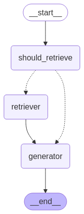

# LLM_agents

## Overview

**LLM_agents** is a framework for building intelligent, agentic systems using Large Language Models (LLMs). This project leverages LangChain, ChromaDB, and LangGraph to create a modular and extensible pipeline for document retrieval, context generation, and response generation. The system is designed to handle complex queries by retrieving relevant information from a vector database and generating accurate, context-aware responses using LLMs.

## Key Features

- **Document Retrieval**: Uses a vector database (ChromaDB) to retrieve the most relevant documents based on user queries. Supports advanced filtering options like date-based filtering.
- **Context-Aware Response Generation**: Combines retrieved documents with user queries to generate detailed and accurate responses using LLMs such as `ChatGoogleGenerativeAI`.
- **Modular Workflow**: Built using LangGraph's `StateGraph`, enabling a flexible and extensible pipeline with clearly defined nodes and edges.
- **Conditional Execution**: Dynamically decides whether to perform document retrieval or directly generate responses based on the state of the query.
- **Customizable Prompts**: Supports custom prompt templates for fine-tuned response generation tailored to specific use cases.
- **Telegram Bot Integration**: Enables users to interact with the system via Telegram, upload PDF documents for indexing, and query the indexed data.

## How It Works

The system is built around a LangGraph `StateGraph` that orchestrates the flow of data between different nodes:

1. **`should_retrieve` Node**: Determines whether document retrieval is necessary based on the query state.
2. **`retriever` Node**: Retrieves relevant documents from the vector database using semantic search and optional filters.
3. **`generator` Node**: Generates a response using the retrieved context and the query, leveraging an LLM.

The graph is compiled into an executable agent that can process user queries end-to-end.

### Workflow Diagram



- Conditional edges allow skipping the `retriever` node if retrieval is not required.


## Installation

1. Clone the repository:
   ```bash
   git clone https://github.com/your-repo/LLM_agents.git
   cd LLM_agents/RAG_BOT
   ```

2. Install dependencies:
   ```bash
   pip install -r requirements.txt
   ```

3. Set up environment variables:
   - Create a `.env` file in the `RAG_BOT` directory.
   - Add necessary configuration values (e.g., API keys, database connection details).

## Usage

### Building and Running the Agent

1. Import the `build_agent` function from `rag_agent.py` and initialize the vector database using the `VectorStore` class:
   ```python
   from RAG_BOT.rag_agent import build_agent
   from RAG_BOT.vector_store import VectorStore
   from RAG_BOT.config import Config

   # Initialize the vector database
   config = Config()
   vector_store = VectorStore(config.VECTOR_STORE_PATH)
   vectordb = vector_store.get_vectordb()

   # Build the agent
   agent = build_agent(vectordb, model_name=config.LLM_MODEL_NAME)

   # Invoke the agent with a query
   response = agent.invoke({"query": "What is the purpose of human life?"})
   print(response)
   ```

2. Customize the agent by modifying the nodes or parameters in `rag_agent.py`.

### Telegram Bot Integration

The project includes a Telegram bot implementation that allows users to interact with the system via chat. The bot provides the following functionalities:

1. **Uploading PDF Documents**:
   - Users can upload PDF documents directly to the bot.
   - The bot processes the uploaded PDFs, extracts text, and indexes the content in the vector database for future queries.

2. **Querying the Indexed Data**:
   - Users can query the indexed data using the `/query` command followed by their query.
   - Example: `/query What are the main points regarding remembrance that Baba talks about?`
   - Users can also include a date filter in their query using the format `date:YYYY-MM-DD`.
   - Example: `/query What are the main points regarding remembrance? date:1969-02-02`

3. **General Queries**:
   - Users can ask general questions, and the bot will respond using the LLM without relying on the indexed data.

4. **Help and Commands**:
   - The bot provides a `/help` command to display available commands and usage instructions.

#### Running the Telegram Bot

1. Set up your Telegram bot token in the `.env` file:
   ```plaintext
   TELEGRAM_BOT_TOKEN=<your-telegram-bot-token>
   ```

2. Run the bot script:
   ```bash
   python bot.py
   ```

3. Interact with the bot on Telegram:
   - Start the bot by sending the `/start` command.
   - Upload PDF documents or send queries to get responses.

## Configuration

The project uses a centralized configuration class (`Config`) defined in `config.py`. Key settings include:
- **Temperature**: Controls the randomness of the LLM's responses.
- **System Prompt**: Defines the base instructions for the LLM.
- **VECTOR_STORE_PATH**: Path to the directory where the vector database is stored.
- **LLM_MODEL_NAME**: Name of the LLM model to use for response generation.
- **TELEGRAM_BOT_TOKEN**: Token for the Telegram bot.
- **WEBHOOK_URL**: URL for setting up the Telegram bot webhook.

## Contributing

Contributions are welcome! Feel free to open issues or submit pull requests to improve the project.

## License

This project is licensed under the MIT License. See the `LICENSE` file for details.

## Acknowledgments

- [LangChain](https://github.com/hwchase17/langchain) for orchestration and LLM integration.
- [ChromaDB](https://www.trychroma.com/) for vector database support.
- [LangGraph](https://github.com/langgraph/langgraph) for graph-based workflow management.


[def]: image.png