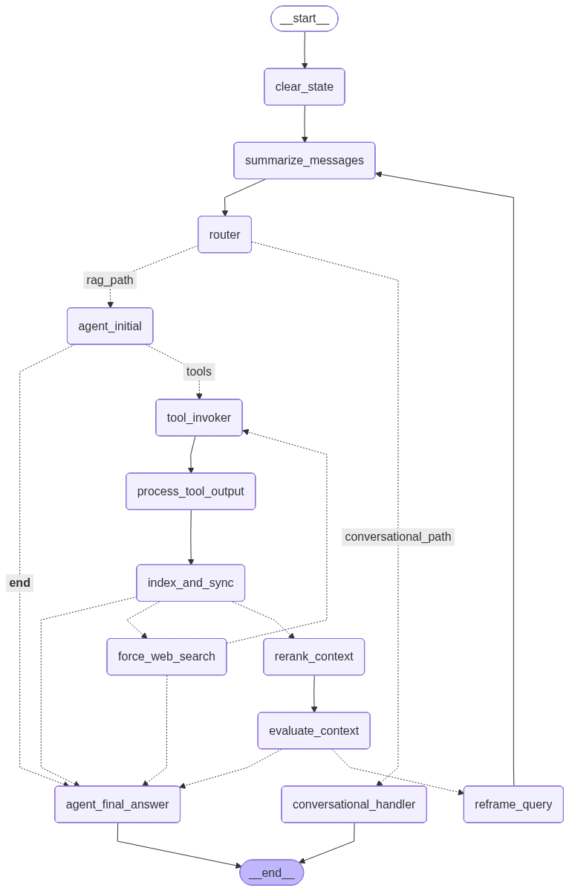

# RAG_BOT: Telegram RAG Agent to answer spiritual questions

This project implements a Telegram bot powered by a sophisticated, stateful agent built with Langchain and LangGraph. The agent is designed to answer questions based on a collection of spiritual documents, but it can also handle general conversation, remembering the context of your chat.

## Features

*   **Telegram Interface:** Interact with the RAG agent directly through Telegram.
*   **Advanced Agentic Workflow:** Utilizes a robust LangGraph agent for:
    *   **Intelligent Routing:** The agent first classifies a user's query to decide whether it's a question requiring knowledge retrieval (a "RAG" query) or a general conversational question (e.g., "summarize our chat").
    *   **Hybrid Search:** Combines semantic and lexical search for comprehensive context retrieval from local documents.
    *   **Web Search Fallback:** Automatically uses Tavily tools to search the web if local retrieval yields insufficient context.
    *   **Reranking** retrieved context using a CrossEncoder model for improved relevance.
    *   Evaluating the relevance of retrieved context.
    *   Reframing the user's query if the initial context is insufficient.
    *   Generating answers (in a structured JSON format) grounded in the retrieved documents (local or web) using Google's Gemini models.
*   **Vector Store:** Uses ChromaDB to store and query document embeddings.
*   **Document Indexing:**
    *   Upload PDF and HTM documents directly to the Telegram bot for automatic indexing.
    *   Automatic indexing of PDF and HTM documents from a specified data directory on startup.
    *   Language detection for uploaded documents.
*   **Conversational Memory:** The agent maintains and summarizes conversation history, allowing it to answer questions about what has been discussed.
*   **Multi-language Support:** Initial support for English and Hindi, with user-selectable language preference via `/language` command and language detection for uploaded documents.
*   **Webhook Deployment:** Designed for deployment using Flask, Gunicorn, and Telegram webhooks.

## Technology Stack

*   **Python:** Core programming language.
*   **Langchain & LangGraph:** Framework for building the RAG agent and defining the workflow.
*   **Google Generative AI (Gemini):** LLM used for understanding queries, evaluating context, reframing questions, and generating answers.
*   **ChromaDB:** Vector database for storing and retrieving document embeddings.
*   **Sentence Transformers:** (via `langchain-huggingface` and `sentence-transformers`) For generating document embeddings and for reranking (CrossEncoder).
*   **pyTelegramBotAPI:** Library for interacting with the Telegram Bot API.
*   **Flask:** Web framework for handling Telegram webhooks.
*   **Gunicorn:** WSGI HTTP server for running the Flask application.
*   **Tavily MCP:** Used for web search capabilities when local retrieval is insufficient.

## How It Works

The agent's intelligence comes from its explicit, graph-based workflow. It maintains an internal **AgentState** that tracks the full conversation history, allowing it to make smart, context-aware decisions.

Here's the step-by-step flow:

1.  **Query Routing:** When a new message arrives, it first goes to a **Router**. This router uses an LLM to classify the user's intent:
    *   **Conversational Query:** If the user asks something like "summarize our chat" or "what was my first question?", the router directs the flow to a dedicated `conversational_handler`. This node uses the full chat history to generate an answer and the process ends.
    *   **RAG Query:** If the user asks a knowledge-based question (e.g., "What did Baba say about...?"), the router sends it down the full RAG pipeline.

2.  **The RAG Pipeline:**
    *   **Tool Calling:** A specialized node uses a focused, "isolated" prompt to reliably decide which tool to call (e.g., `retrieve_context`).
    *   **Smart Retrieval (Hybrid Search):** The agent performs a hybrid search, combining **semantic search** (using embeddings in ChromaDB) and **lexical search** (using BM25) on the local knowledge base.
    *   **Sentence Window Retrieval:** To ensure the LLM receives complete context, the agent doesn't just use the single most relevant chunk. Instead, for each retrieved chunk, it reconstructs a "window" of context by also fetching the chunks immediately before and after it from the original document. This prevents issues where the best matching chunk is only part of a sentence or paragraph, giving the LLM a more coherent and comprehensive view of the information before it's passed on for reranking and final answer generation.
    *   **Context Reranking:** The initially retrieved documents are reranked using a CrossEncoder model to bring the most relevant passages to the top.
    *   **Relevance Evaluation:** The agent evaluates if the reranked context is sufficient to answer the original question.
    *   **Self-Correction & Web Fallback:** If local context is insufficient, the agent rephrases the query and attempts to retrieve information from the web using **Tavily tools**. This acts as a built-in retry mechanism.
    *   **Grounded Generation:** Finally, a dedicated node takes the validated context (from local or web) and the full conversation history to generate a high-quality, grounded answer in a structured JSON format.

This explicit, router-based architecture allows the agent to be both a powerful, accurate RAG system and a coherent, stateful conversationalist without compromising on either capability.

### Workflow Diagram

The following diagram visualizes the agent's workflow :



## Setup

1.  **Clone the repository:**
    ```bash
    git clone <your-repository-url>
    cd RAG_BOT
    ```

2.  **Create a virtual environment:**
    ```bash
    python -m venv venv
    source venv/bin/activate  # On Windows use `venv\Scripts\activate`
    ```

3.  **Install dependencies:**
    ```bash
    pip install -r requirements.txt
    ```

4.  **Configure Environment Variables:**
    Create a `.env` file in the project root directory and add the following variables:
    ```dotenv
    # Telegram
    TELEGRAM_BOT_TOKEN="YOUR_TELEGRAM_BOT_TOKEN"
    WEBHOOK_URL="YOUR_PUBLIC_HTTPS_URL_FOR_WEBHOOK" # e.g., from ngrok or your deployment

    # Google Gemini
    GEMINI_API_KEY="YOUR_GOOGLE_API_KEY"

    # Tavily (for web search fallback)
    TAVILY_API_KEY="YOUR_TAVILY_API_KEY"

    # Paths (adjust if needed)
    VECTOR_STORE_PATH="./chroma_db"       # Default path for ChromaDB
    DATA_PATH="./data"                    # Directory for documents to be indexed on startup
    # INDEXED_DATA_PATH="./indexed_data"  # (Optional) Path to move indexed files, if implemented

    # Agent/Model Config (adjust defaults in config.py or override here)
    # LLM_MODEL_NAME="gemini-1.5-flash-latest" # Or another compatible Gemini model
    # JUDGE_LLM_MODEL_NAME="gemini-1.5-flash-latest" # LLM for evaluating context/responses
    # EMBEDDING_MODEL_NAME="all-MiniLM-L6-v2"
    # RERANKER_MODEL_NAME="cross-encoder/ms-marco-MiniLM-L-6-v2" # Or other CrossEncoder model
    # TEMPERATURE=0.1
    # INITIAL_RETRIEVAL_K=20 # Number of documents to initially retrieve before reranking (semantic)
    # BM25_TOP_K=10          # Number of documents to retrieve using BM25 (lexical)
    # BM25_MAX_CORPUS_SIZE=10000 # Max corpus size for BM25 indexing
    # RERANK_TOP_N=5         # Number of documents to keep after reranking
    # SEARCH_TYPE="similarity" # Or "mmr" (for ChromaDB semantic search)
    # SEMANTIC_CHUNKING=True # Or False
    # LANGUAGE="en" # Default language for the bot (e.g., 'en', 'hi')
    # LOG_LEVEL="INFO"
    # MAX_CONVERSATION_HISTORY=10
    # MAX_RECON_MURLIS=5 # Max Murlis to reconstruct from chunks
    # MAX_CHUNKS_PER_MURLI_RECON=20 # Max chunks to fetch for a single Murli reconstruction
    # MAX_CHUNKS_FOR_DATE_FILTER=40 # Max chunks to consider for date filtering
    # ASYNC_OPERATION_TIMEOUT=60 # Timeout for async operations in seconds
    # PORT=5000 # Port for Flask app
    ```
    *   Replace placeholders with your actual credentials and desired settings.
    *   For local development, ensure the `WEBHOOK_URL` is a publicly accessible HTTPS URL pointing to where your Flask app will run. Tools like `ngrok` can be useful for this. For production on Cloud Run, this will be the URL of your service.

## Deployment to Google Cloud Run

This project is designed for production deployment on Google Cloud Run using a container-based workflow. The provided `Dockerfile` and `cloudbuild.yaml` automate this process.

### Prerequisites

Before deploying, ensure you have the following set up in your Google Cloud project:

1.  **Google Cloud Project:** A project with billing enabled.
2.  **gcloud CLI:** The Google Cloud CLI installed and authenticated (`gcloud auth login`, `gcloud config set project YOUR_PROJECT_ID`).
3.  **Enabled APIs:** Enable the following APIs in your project:
    *   Cloud Build API
    *   Cloud Run Admin API
    *   Artifact Registry API
    *   Secret Manager API
4.  **Artifact Registry:** Create a Docker repository in Artifact Registry to store your container images. The `cloudbuild.yaml` assumes a repository named `cloud-run-source-deploy` in the `us-central1` region.
5.  **Secret Manager:** Store all sensitive credentials (API keys, tokens) as secrets in Google Secret Manager. The `cloudbuild.yaml` is configured to securely mount these secrets into the Cloud Run service. The required secrets are:
    *   `GOOGLE_API_KEY`
    *   `GEMINI_API_KEY`
    *   `TAVILY_API_KEY`
    *   `TELEGRAM_BOT_TOKEN`
    *   `LANGCHAIN_API_KEY`
6.  **Google Cloud Storage (GCS):** Create a GCS bucket to store the ChromaDB vector store persistently. The `startup.sh` script in the Docker image will download the database from this bucket on startup. Update the `GCS_VECTOR_STORE_PATH` environment variable in `cloudbuild.yaml` to point to your bucket (e.g., `gs://your-rag-bot-bucket`).

### Deployment Process

The deployment is automated using Cloud Build.

1.  **Dockerfile:** The `Dockerfile` is a multi-stage build file that:
    *   **Builder Stage:** Installs Python dependencies and pre-downloads and caches the large embedding and reranker models from Hugging Face. This makes the final image smaller and startup times faster.
    *   **Runtime Stage:** Creates a lean final image, copies the installed dependencies and cached models from the builder stage, installs `gsutil` for GCS access, and sets up the application code.

2.  **cloudbuild.yaml:** This file defines a three-step CI/CD pipeline:
    *   **Build:** Builds the Docker image using the `Dockerfile`.
    *   **Push:** Pushes the built image to your Artifact Registry repository.
    *   **Deploy:** Deploys the new image to your Cloud Run service (`rag-bot`). This step also configures all necessary service settings, including memory, CPU, environment variables, and mounts the secrets from Secret Manager.

3.  **Triggering the Deployment:**
    To deploy the agent, run the following command from the root of the project directory (`LLM_agents`):
    ```bash
    gcloud builds submit --config cloudbuild.yaml .
    ```
    Cloud Build will execute the steps defined in `cloudbuild.yaml`, and your Cloud Run service will be updated with the new version of the bot. The first deployment will create the service. After deployment, remember to set the Telegram webhook to your new Cloud Run service URL.

## Usage

1.  **Start the Bot:**
    Ensure your `.env` file is configured. If using Docker (recommended for Gunicorn):
    ```bash
    docker build -t rag-bot .
    docker run -p 5000:5000 --env-file .env rag-bot
    ```
    Alternatively, to run directly with Gunicorn (if installed locally):
    ```bash
    gunicorn -b 0.0.0.0:5000 bot:app
    ```
    Or for development with Flask's built-in server:
    ```bash
    python bot.py
    ```
    This will start the application server and set up the Telegram webhook. The bot will also attempt to index any documents found in the `DATA_PATH` directory.

2.  **Interact with the Bot on Telegram:**
    *   Find your bot on Telegram.
    *   Send `/start` to initiate interaction.
    *   Send `/help` to see available commands.
    *   **Set Language:** Use `/language hindi` or `/language english` to set your preferred language for bot responses.
    *   **Upload Documents:** Send PDF or HTM documents directly to the chat to have them indexed. The bot will attempt to detect the document's language and index it.
    *   **Query Documents:**
        *   Send a general message: `What were the main points about soul consciousness on 1969-01-23?` (The agent will attempt retrieval).
    *   **Conversational Questions:** Ask questions about the chat itself (e.g., "summarize our conversation"). The agent will use its memory to answer.

## Running Tests

Navigate to the project root directory and run the integration tests using `unittest`:

```bash
python -m unittest discover -s RAG_BOT/tests/integration -p 'test_*.py'
```

## Contributing

Contributions are welcome! Feel free to open issues or submit pull requests to improve the project.

## License

This project is licensed under the MIT License. See the `LICENSE` file for details.

## Acknowledgments

- [LangChain](https://github.com/hwchase17/langchain) for orchestration and LLM integration.
- [ChromaDB](https://www.trychroma.com/) for vector database support.
- [LangGraph](https://github.com/langgraph/langgraph) for graph-based workflow management.

[def]: image.png